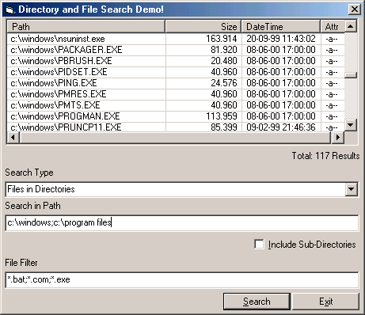



## Directory and File Search Demo v1\.2

### Description

Search for a directories, sub-directories and files and sub-files without having objects on your form! You can even search in more directories! or use file-filters (*.bat;*.com;*.exe;ect...) and file-attributes (read only, hidden, ect...) while you search! This all in just one simply command! This version is much easer to use than the preview demo version 1.0. The results in this version also doesn't import duplicated results and some bugs are fixed. The results gives now also the size, date & time, and attributes. In the next version I will add some more commands, like a compleet directory/file browser. It sounds unbelievable but it's true. It's very easy and fast to use and it's over 100% user friendly! No heavy codes anymore just use this for all your codes! Download the file and see it yourself, I know you'll love this code!!!... I will release more codes when you vote for me, happy coding...
 
### More Info
 

             |
---                |---
**Submitted On**   |2000-11-17 22:33:30
**By**             |[MAGiC MANiAC^mTo](https://github.com/Planet-Source-Code/PSCIndex/blob/master/ByAuthor/magic-maniac-mto.md)
**Level**          |Beginner
**User Rating**    |4.4 (53 globes from 12 users)
**Compatibility**  |VB 6\.0
**Category**       |[Files/ File Controls/ Input/ Output](https://github.com/Planet-Source-Code/PSCIndex/blob/master/ByCategory/files-file-controls-input-output__1-3.md)
**World**          |[Visual Basic](https://github.com/Planet-Source-Code/PSCIndex/blob/master/ByWorld/visual-basic.md)
**Archive File**   |[CODE\_UPLOAD1178711172000\.zip](https://github.com/Planet-Source-Code/magic-maniac-mto-directory-and-file-search-demo-v1-2__1-11481/archive/master.zip)

